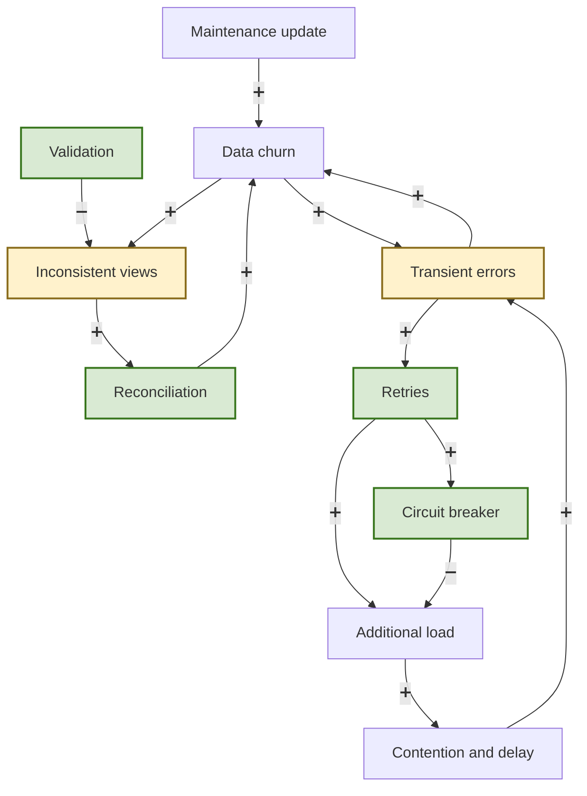

```mermaid
graph TD
  Update[Maintenance update] -->|➕| Churn[Data churn]
  Validation[Validation] -->|➖| Drift[Inconsistent views]
  Churn -->|➕| Drift
  Drift -->|➕| Reconcile[Reconciliation]
  Reconcile -->|➕| Churn

  Churn -->|➕| Error[Transient errors]
  Error -->|➕| Churn
  Error -->|➕| Retries[Retries]
  Retries -->|➕| CircuitBreaker[Circuit breaker]
  Retries -->|➕| Load[Additional load]
  CircuitBreaker -->|➖| Load
  Load -->|➕| Contention[Contention and delay]
  Contention -->|➕| Error

  classDef signal fill:#fff2cc,stroke:#8a6d1d,stroke-width:2px;
  classDef lever fill:#d9ead3,stroke:#38761d,stroke-width:2px;
  class Drift,Error signal;
  class Retries,Reconcile,Validation,CircuitBreaker lever;
``` 
