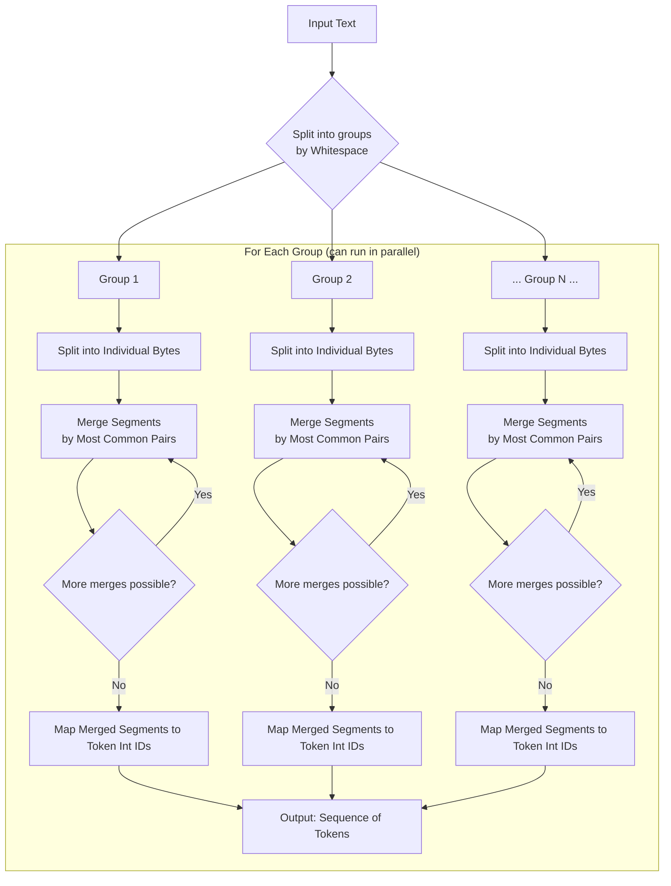

```mermaid
flowchart TD
    A[Input Text] --> B{Split into groups<br>by Whitespace}
    B --> C[Group 1]
    B --> D[Group 2]
    B --> E[... Group N ...]
    
    subgraph Parallel_Process_1["For Each Group (can run in parallel)"]
        C --> F1[Split into Individual Bytes]
        F1 --> G1[Merge Segments<br>by Most Common Pairs]
        G1 --> D1{More merges possible?}
        D1 -- Yes --> G1
        D1 -- No --> H1[Map Merged Segments to Token Int IDs]
        H1 --> I[Output: Sequence of Tokens]

        D --> F2[Split into Individual Bytes]
        F2 --> G2[Merge Segments<br>by Most Common Pairs]
        G2 --> D2{More merges possible?}
        D2 -- Yes --> G2
        D2 -- No --> H2[Map Merged Segments to Token Int IDs]
        H2 --> I

        E --> F3[Split into Individual Bytes]
        F3 --> G3[Merge Segments<br>by Most Common Pairs]
        G3 --> D3{More merges possible?}
        D3 -- Yes --> G3
        D3 -- No --> H3[Map Merged Segments to Token Int IDs]
        H3 --> I
    end
```
