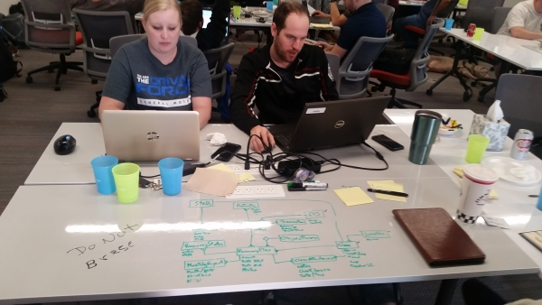

## AZGiveCamp Has Gone Virtual for 2020

Due to the Covid-19 situation, the organize-nerds of AZGiveCamp have decided to hold smaller, virtual events until further notice. Please sign-up on our [Meetup page](http://meetup.com/azgivecamp) to be notified when these events are occurring.

AZGiveCamp is an organization that puts software creators come together with some great local charities to build software that helps those charities further their mission.  Most of these non-profit organizations do not have the resources to have an IT staff of their own so the software we create for them can truly make a difference in helping them achieve their goals for our community.  I am proud to have been one of the founders of AZGiveCamp, and to have spent the last decade leading its day-to-day activities.

A typical AZGiveCamp Hackathon-of-Help event lasts a full weekend, starting on Friday afternoon and running through Sunday afternoon. As our friend and colleague [Rob Richardson](http://twitter.com/rob_rich) likes to say:

> Sleep is optional, caffeine is provided.

If you'd like to find out more about AZGiveCamp, please see our [website](http://azgivecamp.org) or sign-up on our [Meetup page](http://meetup.com/azgivecamp).

