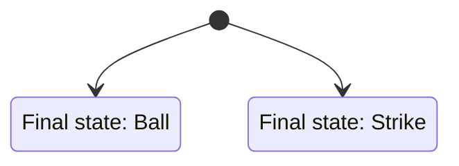
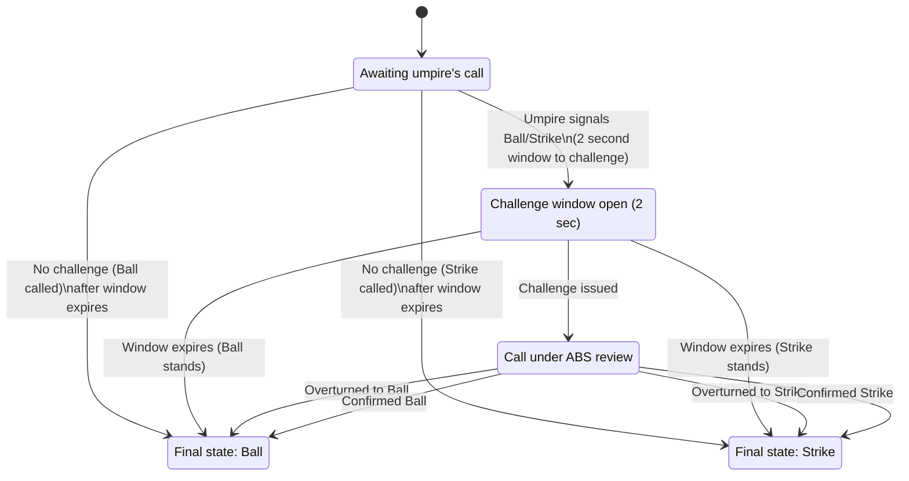

For over a century, the outcome of every baseball pitch could be described by a beautifully simple domain model. Each pitch delivered from mound to plate entered a world of just two possible outcomes: ball or strike. There was comfort in that binary call, a decisive moment that everyone on the field and in the stands could immediately understand. When the umpire signaled, there was no ambiguity; the model was straightforward, even when a mistake was made. Fans may have grumbled about a blown call, but no one puzzled over the system itself. Its deterministic clarity demanded almost no mental energy to track and left little room for confusion or debate. This was the baseline: a universe governed by a single, shared understanding: pitch in, call out, a rulebook written in black and white.

## Technology Arrives, But Only Halfway

Major League Baseball, always chasing the ideal of a perfectly called game, eventually turned to technology for help. ABS (Automated Balls/Strikes) an agentic strike zone, offered a vision of greater accuracy and consistency, a modern answer to the age-old drawbacks of human judgment. Yet, rather than fully embracing this leap into automation, MLB charted a middle path. Human umpires still make the call, but now their decisions can be challenged and reviewed by the ABS system, injecting a layer of digital oversight as an optional add-on. On paper, this hybrid promises the best of both worlds. In practice, it’s neither a pure human nor a pure machine solution, but something in between; a compromise disguised as progress. This is MLB’s "call to adventure" but already a tentative, conditional one. As with any hybrid system, this approach carries an underappreciated cost: complexity begins to creep in, often multiplying instead of streamlining the experience.

## The Six-State Tangle: When a Strike Isn’t Just a Strike

Systems are shaped by the states they recognize and the transitions between them. For a hundred years, baseball’s model was elegantly spare—every pitch lived in one of two states: a ball or a strike. Nothing to memorize, nothing to manage. But with the introduction of ABS challenges, things quietly got more complicated. Now, what used to be a simple call must traverse a web of possible verdicts before it’s settled.

Instead of the old binary, we suddenly have six distinct states: an “unconfirmed” ball or strike (the original umpire call, lingering in limbo); a “confirmed” ball or strike (the human call, validated by the machine); and two overturned results: a strike ruled a ball, or a ball ruled a strike by ABS review. Each is a separate status with its own implications for the game and its participants.

Here’s the twist: none of this scaffolding exists for the sake of baseball itself. These aren’t states that matter to the nature of pitching or hitting, but layers imposed to manage and rationalize a half-technological, half-human system. What once took a single mental step now takes six, not to deepen the game, but to patch over the seams between old and new.

To appreciate just how much complexity the ABS system introduces, compare it to the pre-ABS state machine—there were only two possible destinations for every pitch:

Before we move on, consider how many more states and transitions actually exist between pitch and final call. The ABS hybrid system introduces an array of possible intermediate states—calls waiting out the challenge window, calls under review, and ultimately, a return to a simple Ball or Strike. The diagram below illustrates the expanded state machine that now governs the fate of every pitch:

## **IV. The Descent: Complexity Has a Cost**

- Explain why added states matter in any system:
  - More transitions  
  - More edge cases  
  - More rules  
  - More timing considerations  
  - More opportunities for misalignment between intent and behavior  
- Connect to software/system design: state explosion is a known source of fragility and user confusion.  
- Complexity isn’t neutral — it shapes behavior and attention.

## **V. The Consequence: A Meta‑Game Emerges**

- Show how the six‑state system changes the lived experience:
  - Catchers deciding whether to burn a challenge early.  
  - Hitters signaling for challenges.  
  - Managers tracking challenge inventory like a resource.  
  - Fans parsing “confirmed” vs. “overturned” vs. “unconfirmed.”  
- The game now includes a **state‑management layer** that didn’t exist before.  
- This is the “darkest moment” — the realization that the system is now driving the experience.

## **VI. The Return: The Simpler, Better Alternative**

- Present full ABS (no challenges) as the *simplest* system, not the most technical:
  - Two states  
  - Zero transitions  
  - No challenge inventory  
  - No meta‑decisions  
  - No artificial scaffolding  
- It’s a deterministic function: **pitch in → call out**.  
- The irony: the fully automated system is the least complex and the most predictable.

## **VII. Closing Insight: Complexity Is a Choice**

- Zoom out to the broader systems‑thinking lesson:
  - Hybrid solutions often create more complexity than either pure approach.  
  - Added states introduce friction, cognitive load, and unintended strategy.  
  - When designing systems — in baseball or in tech — the simplest model that achieves the goal is usually the most resilient.  
- Close with a crisp takeaway:  
  **If the goal is accuracy and consistency, the path with the fewest states wins.**
