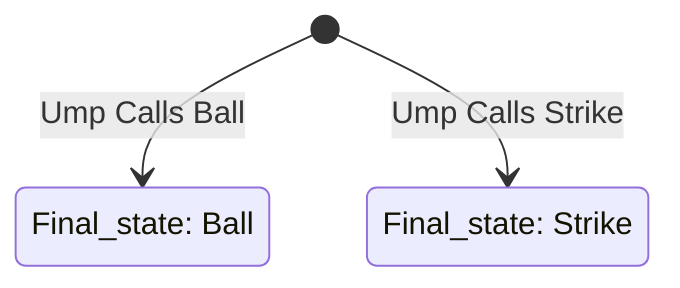
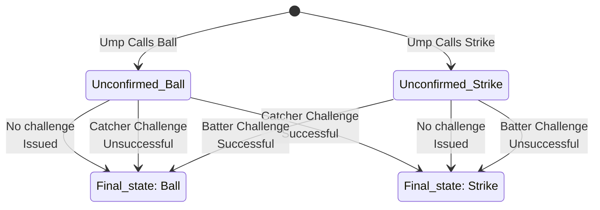

For over a century, every baseball pitch was governed by a simple model with two possible outcomes: ball or strike. The binary call provided clarity and was understood by everyone on the field and in the stands. When the umpire signaled, the result was unambiguous, even when the call was wrong. Fans might grumble about blown calls, but the system itself was not questioned. Its simplicity required little mental effort to follow and left little room for confusion or debate. That was the baseline: a shared understanding of pitch in, call out, with the rulebook treated as final.

## Technology Arrives, But Only Halfway

Major League Baseball, long in pursuit of the perfectly called game, eventually turned to technology for help. Events like Armando Galarraga’s near-perfect game in 2010, along with the apparent success of the replay challenge system, may have made a challenge-based ABS model seem more attractive, even though ABS is a different system with different mechanics and implementation. ABS, or Automated Balls and Strikes, offered a more accurate and consistent strike zone, a modern response to the limits of human judgment. MLB did not fully hand the decision over to automation, however. Instead, it chose a hybrid approach: umpires still make the initial call, and those calls can then be challenged and reviewed by ABS. The result is not simply a better version of the old system; it is a layered process that preserves human involvement while adding machine oversight. That layering may improve accountability, but it also adds complexity, and the challenge step can make the experience harder rather than simpler to follow.

## The State-Machine Tangle: When a Strike Isn’t Just a Strike

Systems are shaped by the states they recognize and the transitions between them. For a hundred years, baseball’s model was elegantly spare—every pitch lived in one of two states: a ball or a strike. Nothing to memorize, nothing to manage. But with the introduction of ABS challenges, things quietly got more complicated. Now, what used to be a simple call must traverse a web of possible verdicts before it’s settled.

Instead of the old binary, we suddenly have six distinct states: an “unconfirmed” ball or strike (the original umpire call, lingering in limbo); a “confirmed” ball or strike (the human call, validated by the machine); and two overturned results: a strike ruled a ball, or a ball ruled a strike by ABS review. Each is a separate status with its own implications for the game and its participants.

Here’s the twist: none of this scaffolding exists for the sake of baseball itself. These aren’t states that matter to the nature of pitching or hitting, but layers imposed to manage and rationalize a half-technological, half-human system. What once took a single mental step now takes six, not to deepen the game, but to patch over the seams between old and new.

To appreciate just how much complexity the ABS system introduces, compare it to the pre-ABS state machine—there were only two possible destinations for every pitch:

With the new ABS hybrid system, MLB has introduced a set of intermediate states and transitions that eventually result in the same Ball or Strike call. The diagram below illustrates the expanded state machine that now governs the fate of every pitch:

## **IV. The Descent: Complexity Has a Cost**

- Explain why added states matter in any system:
  - More transitions  
  - More edge cases  
  - More rules  
  - More timing considerations  
  - More opportunities for misalignment between intent and behavior  
- Connect to software/system design: state explosion is a known source of fragility and user confusion.  
- Complexity isn’t neutral — it shapes behavior and attention.

## **V. The Consequence: A Meta‑Game Emerges**

- Show how the six‑state system changes the lived experience:
  - Catchers deciding whether to burn a challenge early.  
  - Hitters signaling for challenges.  
  - Managers tracking challenge inventory like a resource.  
  - Fans parsing “confirmed” vs. “overturned” vs. “unconfirmed.”  
- The game now includes a **state‑management layer** that didn’t exist before.  
- This is the “darkest moment” — the realization that the system is now driving the experience.

## **VI. The Return: The Simpler, Better Alternative**

- Present full ABS (no challenges) as the *simplest* system, not the most technical:
  - Two states  
  - Zero transitions  
  - No challenge inventory  
  - No meta‑decisions  
  - No artificial scaffolding  
- It’s a deterministic function: **pitch in → call out**.  
- The irony: the fully automated system is the least complex and the most predictable.

## **VII. Closing Insight: Complexity Is a Choice**

- Zoom out to the broader systems‑thinking lesson:
  - Hybrid solutions often create more complexity than either pure approach.  
  - Added states introduce friction, cognitive load, and unintended strategy.  
  - When designing systems — in baseball or in tech — the simplest model that achieves the goal is usually the most resilient.  
- Close with a crisp takeaway:  
  **If the goal is accuracy and consistency, the path with the fewest states wins.**
