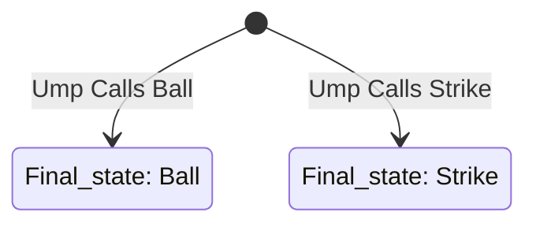
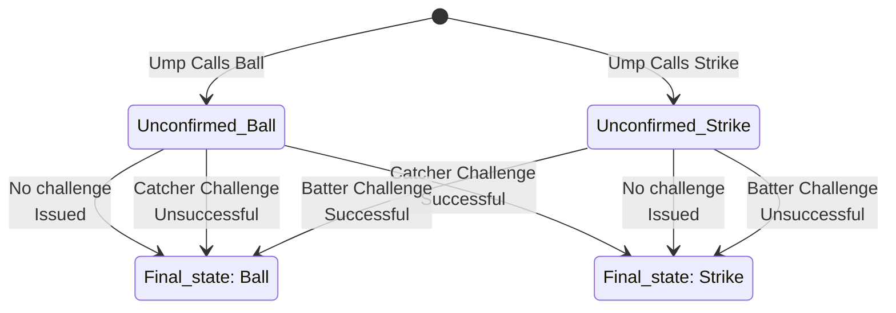

For over a century, every baseball pitch was governed by a simple model with two possible outcomes: ball or strike. The binary call provided clarity and was understood by everyone on the field and in the stands. When the umpire signaled, the result was unambiguous, even when the call was wrong. Fans might grumble about blown calls, but the system itself was not questioned. Its simplicity required little mental effort to follow and left little room for confusion or debate. That was the baseline: a shared understanding of pitch in, call out, with the rulebook treated as final.

## Technology Arrives, But Only Halfway

Major League Baseball, long in pursuit of the perfectly called game, eventually turned to technology for help. Events like Armando Galarraga’s near-perfect game in 2010, along with the apparent success of the replay challenge system, may have made a challenge-based ABS model seem more attractive, even though ABS is a different system with different mechanics and implementation. ABS, or Automated Balls and Strikes, offered a more accurate and consistent strike zone, a modern response to the limits of human judgment. MLB did not fully hand the decision over to automation, however. Instead, it chose a hybrid approach: umpires still make the initial call, and those calls can then be challenged and reviewed by ABS. The result is not simply a better version of the old system; it is a layered process that preserves human involvement while adding machine oversight. That layering may improve accountability, but it also adds complexity, and the challenge step can make the experience harder rather than simpler to follow.

## The State-Machine Tangle: When a Strike Isn’t Just a Strike

Systems are shaped by the states they recognize and the transitions between them. For a hundred years, baseball’s model was elegantly spare—every pitch lived in one of two states: a ball or a strike. Nothing to memorize, nothing to manage. But with the introduction of ABS challenges, things quietly got more complicated. Now, what used to be a simple call must traverse a web of possible verdicts before it’s settled.

Instead of the old binary, we suddenly have six distinct states: an “unconfirmed” ball or strike (the original umpire call, lingering in limbo); a “confirmed” ball or strike (the human call, validated by the machine); and two overturned results: a strike ruled a ball, or a ball ruled a strike by ABS review. Each is a separate status with its own implications for the game and its participants.

Here’s the twist: none of this scaffolding exists for the sake of baseball itself. These aren’t states that matter to the nature of pitching or hitting, but layers imposed to manage and ration access to truth.

To appreciate just how much complexity the ABS system introduces, compare it to the pre-ABS state machine—there were only two possible destinations for every pitch:

```mermaid
stateDiagram-v2
    [*] --> Ball: Ump Calls Ball
    [*] --> Strike: Ump Calls Strike

    Ball : Final_state: Ball
    Strike : Final_state: Strike
```

With the new ABS hybrid system, MLB has introduced a set of intermediate states and transitions that eventually result in the same Ball or Strike call. The diagram below illustrates the expanded system:

```mermaid
stateDiagram-v2
    [*] --> Unconfirmed_Ball: Ump Calls Ball
    [*] --> Unconfirmed_Strike: Ump Calls Strike

    Unconfirmed_Ball --> Ball: No challenge<br/>Issued
    Unconfirmed_Ball --> Ball: Catcher Challenge<br/>Unsuccessful
    Unconfirmed_Ball --> Strike: Catcher Challenge<br/>Successful

    Unconfirmed_Strike --> Strike: No challenge<br/>Issued
    Unconfirmed_Strike --> Strike: Batter Challenge<br/>Unsuccessful
    Unconfirmed_Strike --> Ball: Batter Challenge<br/>Successful

    Ball : Final_state: Ball
    Strike : Final_state: Strike

```

## A Live Counterexample: WPBL

The Women’s Pro Baseball League (WPBL), currently operating out of Springfield, Illinois, offers a useful contrast. The league does not use MLB’s ABS challenge layer, and the result is a cleaner game flow: each pitch resolves immediately into the same two-state model baseball has always used.

That simplicity matters. Without challenge inventory, review choreography, and overturn bookkeeping, players and fans can focus on pitch execution, sequencing, and situational strategy instead of state management. In systems terms, WPBL avoids adding intermediate states that do not improve the core interaction.

If the goal is to preserve baseball as a game of rhythm and readable outcomes, WPBL shows that the simpler model is not outdated—it is often the better design.

## **IV. The Descent: Complexity Has a Cost**

Complexity is not just a technical property; it is a user-experience cost. Every additional state in a system introduces more transitions, and every transition introduces another chance for hesitation, disagreement, or error. What used to be instantaneous and final now carries conditional logic: who can challenge, when they can challenge, whether it succeeds, and how that outcome is interpreted in context. Even when the final output is still only ball or strike, the path to that output has become crowded.

In system design, this is a familiar pattern. State growth tends to produce edge cases, and edge cases demand rules. Rules then require timing constraints, exception handling, and social coordination among participants. In baseball terms, that means more signaling, more pause points, and more moments where participants are managing process instead of playing. In software terms, it is state explosion: a known source of fragility, cognitive load, and surprising behavior.

The important point is that this cost is not neutral. Added complexity reshapes attention. Players begin optimizing for challenge timing and inventory management. Fans must parse whether they just saw an ordinary call, a provisional one, or a reviewed and overturned outcome. Umpires and broadcasters inherit additional interpretive overhead. None of this directly improves the core act at the heart of the game: pitcher throws, batter reacts, umpire (or system) resolves.

When complexity accumulates faster than value, the system becomes harder to trust, harder to follow, and harder to enjoy. That is the descent: not a dramatic failure, but a gradual shift where procedural scaffolding starts to overshadow the thing it was meant to support.

## **V. The Consequence: A Meta‑Game Emerges**

Once a system introduces optional review states, participants stop engaging only with the core activity and start managing the review mechanism itself. That is exactly what MLB’s challenge-based ABS model creates: a second game layered on top of baseball. The pitch is no longer just a contest between pitcher and hitter; it is also a resource decision about whether this specific moment is worth consuming part of a limited challenge budget.

For catchers, this means constant triage. A close miss that could steal a strike might be worth a challenge early, but using one too soon can leave the defense exposed later when leverage is higher. Hitters face a mirrored decision: protect an at-bat now, or save the challenge for a later pitch sequence that might matter more. Managers, meanwhile, are pulled into inventory tracking—counting available challenges, anticipating future high-leverage spots, and balancing immediate correctness against late-game optionality.

Fans and broadcasters inherit this complexity too. Instead of processing a straightforward call, they must now interpret whether a pitch was merely called, left unchallenged, challenged and confirmed, or challenged and overturned. The vocabulary and timing of the game shift from direct outcomes to procedural states. Attention moves from “what happened on the pitch” to “what state is this call currently in?”

This is the key consequence of hybridization: once process becomes strategic, process begins to shape behavior. The system no longer just adjudicates baseball; it influences how baseball is played, watched, and discussed in real time. That is the meta-game—an added layer of state management that did not previously exist, and that competes with the game itself for cognitive bandwidth.

## **VI. The Return: The Simpler, Better Alternative**

- Present full ABS (no challenges) as the *simplest* system, not the most technical:
  - Two states  
  - Zero transitions  
  - No challenge inventory  
  - No meta‑decisions  
  - No artificial scaffolding  
- It’s a deterministic function: **pitch in → call out**.  
- The irony: the fully automated system is the least complex and the most predictable.

## **VII. Closing Insight: Complexity Is a Choice**

- Zoom out to the broader systems‑thinking lesson:
  - Hybrid solutions often create more complexity than either pure approach.  
  - Added states introduce friction, cognitive load, and unintended strategy.  
  - When designing systems — in baseball or in tech — the simplest model that achieves the goal is usually the most resilient.  
- Close with a crisp takeaway:  
  **If the goal is accuracy and consistency, the path with the fewest states wins.**
