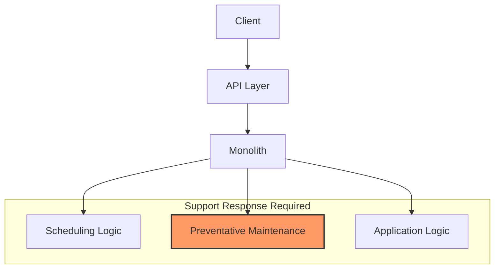
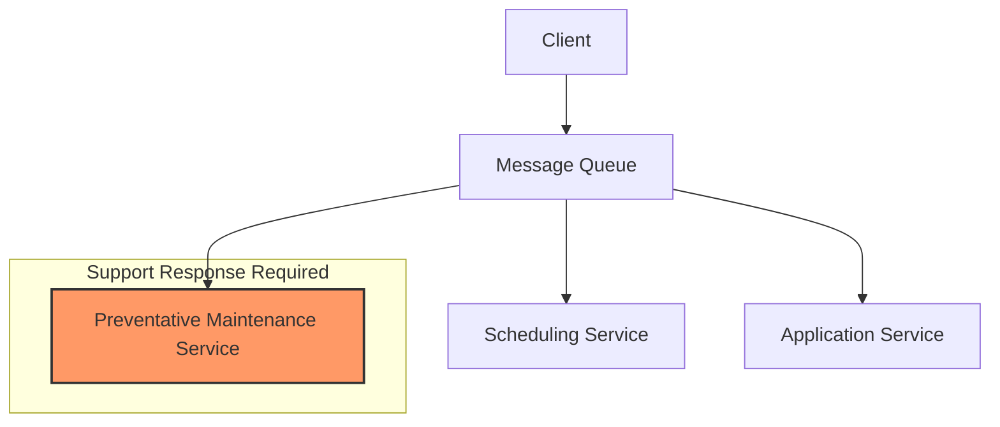

Note: A WIP event storming and other diagrams can be found here: https://lucid.app/lucidchart/3b6a8978-64ab-4458-9dca-88ab3b75767b/edit?beaconFlowId=140CA4DD4F888E74&invitationId=inv_ed1185ed-756e-4d06-84fc-dc6a69f456e6&page=eqs0TI9YjX~X#

There's been some talk lately about well abstracted monoliths and how they may be more effective at times than microservice architectures. While there are almost certainly some use cases where this is true, there are things that a monolith doesn't do as well as other architectures.

TODO: Determine if the below are really true. It seems like at least some of them *could* be done using a monolith, it just might be more difficult. That said, if you are going to do those things, you might as well use a microservice architecture.

* Isolate concerns effectively to contain failures
* Provide a reliable messaging bus for asynchronous communication
* Enable independent deployment and scaling of components
* Clearly delineate responsibility boundaries for support incidents

Monoliths, like microservices, can abstract the various concerns to reduce the coupling between them, but monoliths make it much more difficult to determine in which concern a failures occurred, often requiring teams to respond to support issues unnecessarily. Additionally, it is far more risky to add new functionality to a monolith than it is to add it to an event-driven microservice because of the direct nature of the interactions within a monolith.

In this post, we'll compare three architectures and demonstrate why completely separating concerns is important in most non-trivial cases.

## Our Problem Domain

For this example, we'll use an urban bus service provider. When a bus returns to the depot from its daily route, it is cleaned, and then parked in the appropriate staging area for the next day's activities. There are separate staging areas for busses that will be running routes than for those that will be going into the maintenance shop to have work performed. Our application needs to inform the user which staging area to park the bus in when it returns from its route.

The work we need to perform in each of the architectures is to determine if a bus is scheduled to move passengers tomorrow. To do so, we need our *Scheduling* subsystem to check with the various *Maintenance* subsystems to see if the bus is due for maintenance, or if there is a high probability of a failure occurring between now and the end of the bus's run tomorrow.

The development teams supporting this tooling are as follows:

* **Application** - A team of front-end developers working in HTML5, CSS, JavaScript and supporting libraries, as well as back end developers working server-side in technologies such as C#, Java, and Node. This team is responsible for the user interface and the API that supports it.
* **Scheduling** - A team of operations research scientists who are experts in scheduling and optimization, often using Mixed-Integer Programming (MIP) models to perform assignments of busses to routes. Work is done primarily in Python.
* **Preventative Maintenance** - A team of data scientists who work primarily with predictive models, usually based on Machine Learning, to determine when maintenance should be performed on busses. This team is also responsible for making sure that legal requirments for maintenance are met, often using logical models. This team works primarily in Python.

We'll assume for the purpose of demonstration, that each subdomain is supported by a different development team.

## Architecture 1: Monolith

In Architecture 1, all 3 subsystems are contained within a single monolith. The Scheduling subsystem receives an API call, then internally calls the Preventative Maintenance and Application subsystems to determine if a bus should be scheduled for maintenance.

The critical issue with this architecture is how failures cascade from the perspective of the Scheduling team:

1. If the Preventative Maintenance subsystem fails (e.g., a machine learning model crashes or returns invalid results), this failure appears as a Scheduling subsystem failure to the end user.

2. When support is alerted about the failure, the Scheduling team must be involved in the initial response, even though the root cause may be in the Preventative Maintenance subsystem.

3. This creates unnecessary support burden for the Scheduling team, who must participate in triage and potentially coordinate with the Preventative Maintenance team to resolve issues that aren't within their domain of expertise.

4. The monolith architecture obscures the true source of failures, making it difficult to route support incidents directly to the responsible team.

Any failures within the monolith impact the entire system and present to the caller as a failure within the scheduling process. This means all teams potentially need to be prepared to deal with support incidents, regardless of where in the system the actual failure occurred.

## Architecture 2: Separated API and Business Rules Services

In Architecture 2, the API call is made, validated, and pushed into a reliable messaging system like Azure Service Bus or Apache Kafka. Then, the separate Business Rules Services read the message and perform the necessary work.

When a failure occurs in this architecture:

1. If the Preventative Maintenance service fails, only the Preventative Maintenance team needs to respond, as the failure is isolated to their service.

2. The Scheduling service can implement fallback logic to handle temporary unavailability of the Preventative Maintenance service, such as assuming no maintenance is required or using cached results.

3. The Application team only needs to be involved if the failure occurs during the API validation or message publishing phase.

This architecture significantly reduces cross-team support burden compared to the monolith, as failures are more clearly isolated to specific services and their responsible teams. This can be accomplished through either orchestration or choreography, which is the subject of a future article.

## Architecture 3: Push Messages Directly to Reliable Messaging System

In Architecture 3, we eliminate the need for an API by having the upstream client push the message directly to a reliable messaging system. The Business Rules Services then process the messages from there.

This architecture provides the clearest isolation of concerns:

1. Infrastructure failures (network, messaging system) are handled exclusively by the Infrastructure team.

2. Business logic failures in each service are handled only by the team responsible for that service.

3. The client application can implement retry logic and receive acknowledgments directly from the messaging system.

4. Schema validation can be performed by the messaging infrastructure using formats like ProtoBuf or Avro, eliminating the need for a separate API validation layer.

This approach minimizes support burden by ensuring that only the team with the relevant expertise needs to respond to any given failure, and by leveraging highly reliable infrastructure components to handle message delivery guarantees.

## Comparison of Support Requirements Across Architectures

The following table demonstrates which teams need to respond to different types of failures in each architecture:

| Failure Type | Architecture 1: Monolith | Architecture 2: Separated Services | Architecture 3: Direct Messaging |
|--------------|--------------------------|-----------------------------------|--------------------------------|
| **Message Ingress Failure** | Application Team + potentially all teams for triage | Application Team | Infrastructure Team only |
| **Scheduling Logic Failure** | Scheduling Team + Application Team | Scheduling Team only | Scheduling Team only |
| **Preventative Maintenance Failure** | All teams involved in initial triage | Preventative Maintenance Team only | Preventative Maintenance Team only |
| **Infrastructure Failure** | All teams involved in triage | Infrastructure Team + potentially Application Team | Infrastructure Team only |

As the table demonstrates, in Architectures 1 and 2, failures on message ingress require at least one application team to respond to any failure. This is because these architectures cannot fully isolate application concerns from infrastructure ones. However, in Architecture 3, if there is an Ingress failure, the Infrastructure team is responsible for responding because they are the ones responsible for managing the network and the messaging tooling. Infrastructure implementations also typically offer a higher degree of reliability than applications can.

## Visual Representation of Failure Paths

### Architecture 1: Monolith

### Architecture 3: Direct Messaging

The diagrams above illustrate how a failure in the Preventative Maintenance component affects the support response requirements in different architectures. In Architecture 1, all teams must be involved in the support response, while in Architecture 3, only the Preventative Maintenance team needs to respond.

## Summary

In conclusion, by separating concerns into different services, we can reduce the coupling between different parts of the system and minimize the support requirements for each individual team. Furthermore, by pushing messages directly to a reliable messaging system, we can improve reliability by putting as much burden as possible on the infrastructure pieces, which have the highest reliability guarantees.
