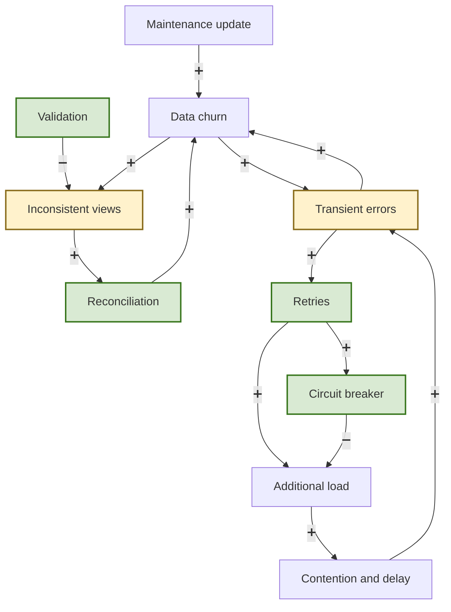

Sometimes the symptom is obvious: the system is "slow", or a usage graph spikes without explanation. Other times, the symptom is more unsettling: users are reporting occasional data errors. The problem is intermittent, difficult to reproduce, and frustratingly resistant to simple explanations. Is it bad input? A particular user or workload? A recent deployment? A dependency behaving badly at just the wrong moment? Often, our first instinct is to look for a single cause. *Signals & Levers*, a new book by Elisabeth Hendrickson and Joel Tosi, offers a different way to approach the problem: treat these incidents as signals inside a larger causal structure, then look for the feedback loops and levers that can explain and change the system's behavior. The book uses examples from software development systems; this article applies those ideas to a software-architecture problem.

What I enjoyed most about *Signals & Levers* is that it helped me connect the dots between systems-thinking concepts and the practical problems engineers face every day. It reframes incidents like these as patterns rather than isolated events: the important question is not always "what broke?" but "what relationships, delays, and feedback loops made this behavior possible?" That perspective gave me a more useful way to think about intermittent data errors and the interventions that might address them. For transparency, I should note that I received temporary access to a pre-release copy in order to review the book, but I am not affiliated with its publisher or authors and have no financial interest in its success. What follows is therefore both a review of the ideas I found useful and an attempt to apply them to a concrete software system.

### A systems-thinking lens for software problems

The book gives us four connected ways to look at a problem like this. **Signals** are the observable clues: the errors, retries, delays, and other changes in system behavior. **Levers** are the things we can adjust in response. **Feedback loops** help explain why a problem persists or amplifies instead of disappearing on its own. **Causal structure** ties those observations together, showing how actions, delays, and dependencies combine over time. Understanding these constructs allows us to look at the problem not as a collection of isolated errors, but as a system whose behavior we can observe, understand, and influence.

To make these ideas concrete, consider a system used to manage bus maintenance. It brings together information about vehicles, maintenance work, schedules, parts, and operational status so that people can plan work and understand the condition of the fleet. Most of the time, the system appears to work as expected. Occasionally, however, users report that the data is wrong: a maintenance update is missing, a status appears inconsistent between views, or information that was correct earlier seems to have changed. The errors are difficult to reproduce and do not seem tied to one particular user or action. That makes the obvious explanations tempting—bad input, one faulty process, a noisy dependency, or a problem during a particular maintenance window—but none of them fully explains the pattern. This is the problem we will use to apply the book's signals, levers, feedback loops, and causal structure.

### Signals & Levers in this system (a few examples)

The first step is to resist the urge to explain the error before understanding its shape. Several signals are worth watching: how often records drift between views, whether retries increase around the same time, whether queues grow when downstream work slows, and whether the errors cluster in brief timing windows. None of these observations proves a cause by itself. Together, however, they can reveal that the problem is not random user behavior or one bad request, but a system whose components are influencing one another over time.

Once the signals suggest that the errors are part of a larger system pattern, the next question is what we can change. We might shape retries so that a transient failure does not create a surge of additional work, apply backpressure or concurrency limits, or isolate a struggling dependency. We might also tighten the ordering of writes or adjust the reconciliation process that repairs divergent data. These are not interchangeable fixes, and each carries a cost. The point is to treat them as levers: deliberate changes whose effects we can observe rather than guesses made in the dark.

### Feedback loops and causal structure

The useful insight is not just that these signals occur together, but that they can reinforce one another. A transient error can trigger a retry; enough retries increase load; increased load creates contention and delay; and that delay produces more errors and still more retries. That is a reinforcing loop. Balancing mechanisms such as validation, reconciliation, circuit breakers, and write throttling can interrupt it, although their effects may not be immediate. Replication lag, repair intervals, telemetry delay, and other time gaps can make the system appear unpredictable even when the underlying pattern is consistent.

A causal-loop diagram makes those relationships easier to see than a list of symptoms. One loop follows the path from data churn to transient errors, retries, increased load, contention, and further errors. A second loop shows how reconciliation, validation, and circuit breakers can change that behavior. The diagram treats data churn as the observable result of architectural choices, timing differences, and partial failure that can make views diverge.

Here, ➕ means that the connected variables move together, while ➖ means that they move in opposite directions. Yellow nodes are signals we observe, such as inconsistent views and transient errors. Green nodes are levers we can adjust, such as retry policy, validation, reconciliation, and circuit breakers.

The next step is to put our theories, developed using these tools, to the test. We can change the retry policy and observe whether inconsistency frequency and queue growth change with it. We can strengthen write ordering or reduce the number of places a write must reach, then watch for a reduction in drift. We can adjust the reconciliation interval and measure whether the repair process keeps up with new inconsistencies. Each experiment should change one meaningful lever, define the signals we expect to move, and account for the delays before deciding whether the hypothesis was supported.

This is where the book's ideas become practical for me. *Signals & Levers* provided the vocabulary for moving beyond the question "which component is broken?" and asking how the system's structure produces the behavior we observe. The bus-maintenance example makes the concepts tangible, but the method is not limited to data errors. The same patterns can make it easier for us to work through performance problems, reliability incidents, and any other situation where the cause is distributed across components and delayed over time.

### Closing

When we identify that problems may be occurring in our systems, the most useful answer may not be to look for a single culprit. The problem may be a pattern of signals, levers, delays, and feedback loops spread across the system. This is the practical value I found in *Signals & Levers*: it offers a way to see those relationships, test our assumptions, and make more deliberate changes. The same approach can help us understand our own systems before their symptoms become incidents we can no longer ignore.
