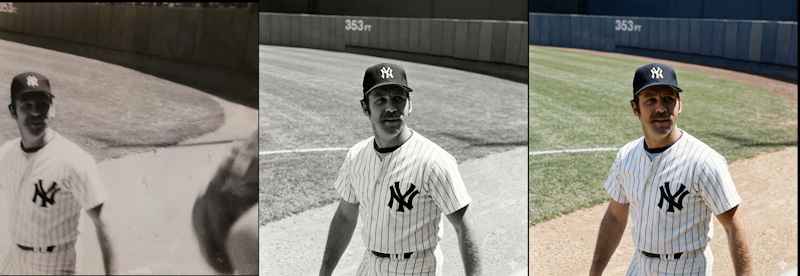

---
tags:
- ai
- ethics
- legislation
- ml
- opinion
menuorder: 0
id: 8a03e594-887c-4412-ae36-23fa3d2cf0c2
author: bsstahl
title: What Counts as AI‑Generated?
description: A childhood photo of a baseball player becomes a case study in why "AI‑generated" isn’t a simple label and why context matters far more than toolchains.
ispublished: false
buildifnotpublished: true
showinlist: false
publicationdate: 2026-03-21T10:19:40.000+00:00
lastmodificationdate: 2026-03-21T10:19:40.000+00:00
slug: what-counts-as-aigenerated
categories:
- Tools

---
I still have the first camera I ever used - a 126 box camera, similar to a [Hawekeye II](https://web.archive.org/web/20251216145350/https://historiccamera.com/cgi-bin/librarium2/pm.cgi?action=app_display&app=datasheet&app_id=3988), that was basically a toy even in its own era. I shot with black‑and‑white film because that’s what a kid could afford, and it produced the kind of photos you’d expect from a plastic lens and a shutter that felt like it was powered by hope. One of those photos captured Thurman Munson, the Yankees catcher who would later die in a plane crash, making him something of a larger-than-life figure in my experience. It’s not a great photo. It’s grainy, off‑center, and full of the accidental foreground clutter you get when you’re small, excited, and holding a camera that doesn’t care about your artistic intent.

Recently, I ended up with three versions of that same moment:

* **The original** - a scan of the actual frame I shot as a kid.  
* **A cleaned‑up version** - run through an AI tool that removed some shadows, centered Munson, and erased the stray arms of the people next to me.  
* **A colorized version** - also AI‑assisted, adding color to a scene that never existed in color on film.

All three images are real in the sense that they correspond to something that actually happened. And all three are altered in the sense that every photograph is shaped by the tools available at the time. So the question I could be asked when I show these images is, **Which of these are "AI‑generated"?**

Unfortunately, that question really can't be answered without a lot more information. All 3 images **used AI** as part of the pipeline in some form or another, because depending on how you define AI, even the act of scanning the original likely used a model. The question we need to answer is: **what do we mean when we say something is "AI‑generated"?**

The cleaned‑up version of this photo didn’t invent anything. It didn’t fabricate Munson’s face or change the moment. It just did what darkroom techniques, Photoshop, and restoration tools have always done. The colorized version added something new, but colorization has existed for more than a century. The only difference is that a machine did the brushwork instead of a human. And the original? It’s still the moment I captured as a kid with a toy camera. The digital version may have passed through modern software on its way to the screen, but the composition, the light, the instant in time - that’s all intact.

## Even "true" photos can mislead, with or without AI

This is where things get tricky. Any still or moving image can create false impressions with the viewer. Strange lighting, unusual shadows, a frozen instant in time that doesn't really capture the essence of the situation. All of these things happen, and we've experienced them. How many times have you taken a photo of someone who was happy, but looked sad or angry in the shot? Was [the dress](https://en.wikipedia.org/wiki/The_dress) blue or gold?

In my three images above, the event happened nearly entirely as presented in those photos. Despite that, the AI‑assisted versions can still create false impressions, sometimes similar to the ones created by a pure "unretouched" photograph.

For example:

* The colorized version might imply the grass at Yankee Stadium looked a certain way that day - when the original black‑and‑white film simply didn’t capture that information.  
* It might suggest Munson wore an undershirt of a particular color - a detail the model had to invent.  
* The cleaned‑up version might imply the scene was less crowded than it really was, because the tool removed the arms of the people next to me.

None of these changes alter the *event*, but they absolutely can alter the *interpretation*. AI can introduce confident, plausible details that were never in evidence. Not *necessarily* maliciously or deceptively, just quietly.

This is why labeling matters. Not because AI involvement is inherently bad, but because, in most cases, viewers deserve to know which parts of an image are grounded in reality and which parts were reconstructed, inferred, or imagined.

## This isn’t even touching the copyright issues

Everything above is about *truth*: what happened, what didn’t, and what an image implies, but there’s a whole separate dimension we haven’t entered: **copyright**.

Questions like:

* What training data was used to create the model?  
* Who owns the derivative works?  
* When does enhancement become transformation?  
* What rights do I retain over my own childhood photo once an AI model has touched it?  

These aren’t footnotes. They’re large, unresolved questions that deserve their own analysis and probably their own regulatory framework. Mixing them into the "AI‑generated vs. not" debate only makes everything muddier. So for this post, I’m deliberately setting copyright aside; not because it’s unimportant, but because it’s *too* important to treat as a parenthetical.

## The Hard Part Is Defining What Matters

The reasons why blanket rules about "AI‑generated content" fall apart are complicated. The line between "generated," "assisted," "enhanced," and "restored" isn’t a line at all, it’s a gradient. That doesn’t mean we shouldn’t regulate AI‑involved media. It means **we need to regulate AI with language and intent that actually matches reality, and solves the real problems**.

There *are* cases where labeling is essential, but most of it is context specific. If I am posting a picture of a conference talk I gave, I wouldn't feel right adding fake participants in the crowd, but I'd often be fine with editing someone out who asked me to, depending on the reason for doing so. I might not feel the same way if the photograph was being published as part of a story in the news. However, there are some things that should probably always be disclosed:

* **Images of things that never happened** should be labeled as such.
* **Images recreated from text descriptions after the fact** should be labeled as such.
* **Synthetic people, synthetic events, synthetic evidence** absolutely require clear disclosure.
* **AI‑assisted reconstructions that add plausible but invented details** should be labeled so viewers understand what’s real and what’s inferred.

Those distinctions matter because they speak to truth, provenance, and the potential for harm, and they remain just as important whether AI is part of the process or not.

But my three images of Thurman Munson? They’re all the same moment, they differ only in the tools used to reveal it. In most contexts, there is no meaningful change made by these manipulations.

There are already existing sets of rules we can lean on here. The The National Press Photographers Association has a [Code of Ethics](https://web.archive.org/web/20260315211924/https://nppa.org/resources/code-ethics) for visual journalists that includes the following:

> Editing should maintain the integrity of the photographic image's content and context. Do not manipulate images or add or alter sound in any way that can mislead viewers or misrepresent subjects.

I would ask you: "Does my manipulation of this image mislead viewers or misrepresent subjects".

These directives also include composition and subject matter rules such as:

* Resist being manipulated by staged photo opportunities
* Be complete and provide context when photographing or recording subjects
* While photographing subjects, do not intentionally contribute to, alter, or seek to alter or influence events
* Do not pay sources or subjects or reward them materially for information or participation
* Do not accept gifts, favors, or compensation from those who might seek to influence coverage

All of which suggests that the editing of images, the part that can be done using AI, is just a small part of the harm that can be done through visual means, albeit one that scales better than most.

## Here’s the part we can’t ignore

AI, in some form, is nearly *always* involved now.

Not necessarily the generative models people are worried about, though those can certainly be used in perfectly legitimate ways. Not the headline‑grabbing systems that synthesize faces or fabricate events, but the quiet, invisible AI that lives inside scanners, cameras, phones, photo apps, and operating systems, the kind nobody thinks about because it doesn’t feel like "AI".

Sharpening, noise reduction, auto‑contrast, white‑balance correction, lens‑distortion fixes, de‑mosaicing, compression artifacts being smoothed away. Other domains have similar tools in autocorrect, predictive-text, grammar correction, spellcheck, voice-to-text, spam filtering and recommendation systems. These are all machine‑learning (ML) systems doing work behind the scenes.

So the question can’t be "Was AI used?"  The questions must be more akin to **"What kind of AI, used how, and to what effect?"** And these questions need to be answered in the full context of the situation.

If we have difficulty categorize these three versions of a childhood photo as "AI-Generated" or not, we definitely can’t build policy around such a binary definition. We need rules that focus on **intent**, **impact**, and **what claims are being made**, not on whether a model was somewhere in the toolchain. Because the truth of this photo is simple, AI didn’t create it, **it actually happened**. The tools just helped me see it more clearly, and they can also help someone else see something that was never there.

Outside of this one childhood snapshot, it’s rarely even *that* simple.
